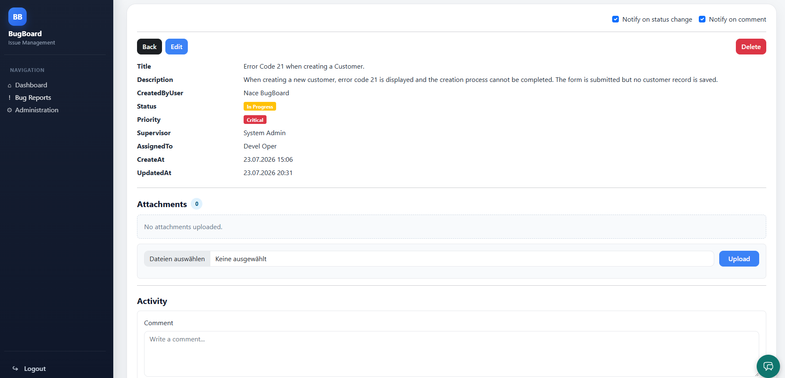
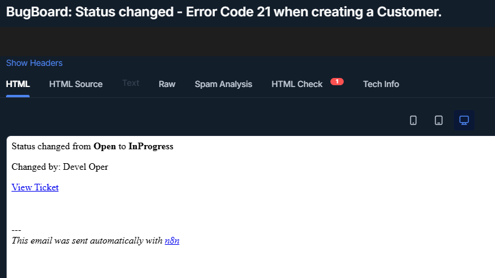
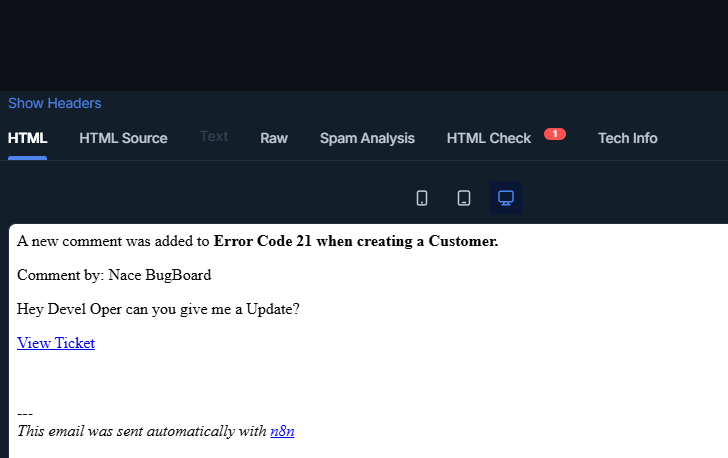
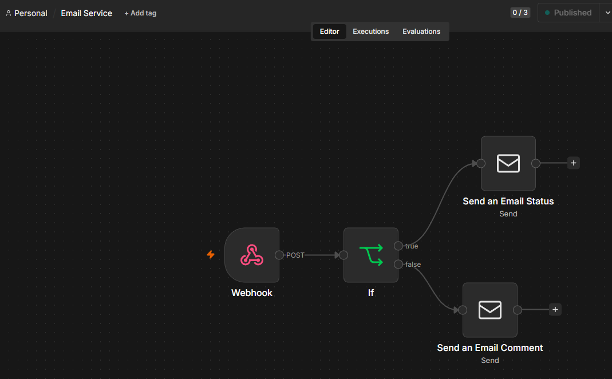
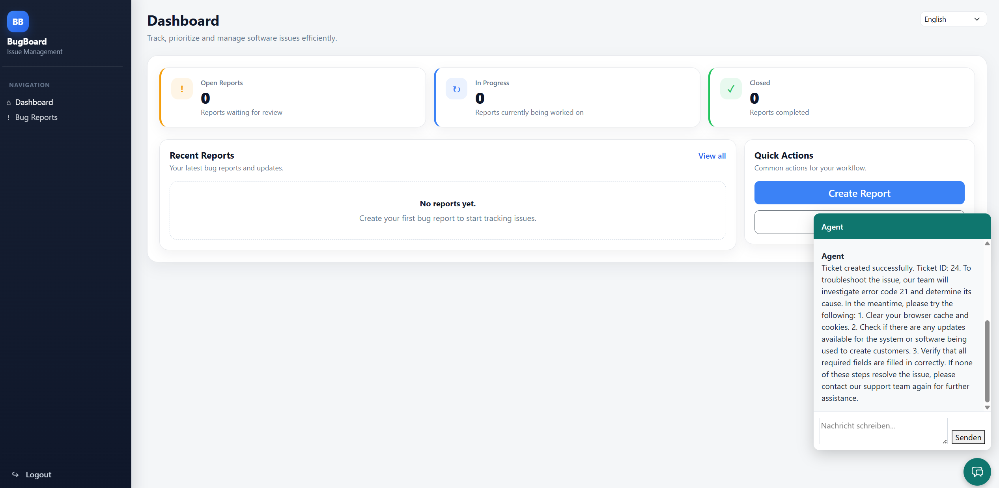
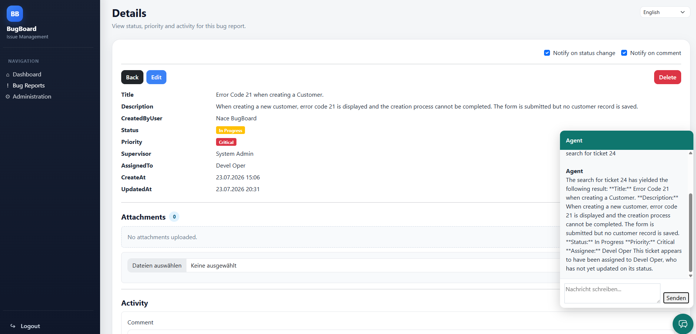
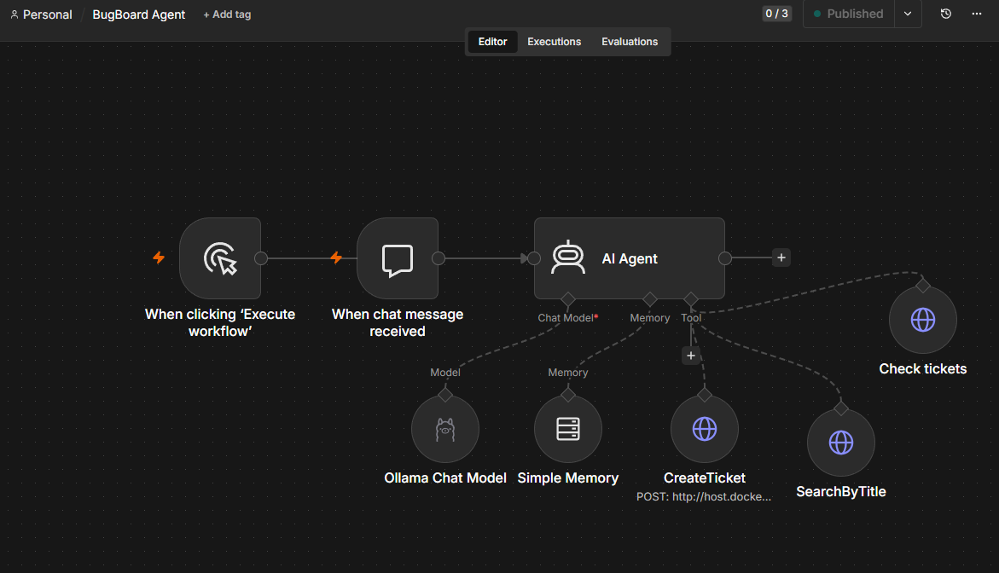

# BugBoard

BugBoard is a web-based ticket and bug tracking application built with ASP.NET Core MVC.

It includes user authentication, role-based authorization, bug report management, activity logs, attachments, filtering, AJAX search, pagination, English/German UI localization, email notifications and an AI agent powered by n8n and Ollama.

---

## Requirements

- .NET SDK
- Git
- EF Core CLI tools
- n8n (for email notifications and AI agent)
- Ollama with llama3.1 (for AI agent)
- An SMTP server (e.g. Mailtrap for local development)
- Optional: DB Browser for SQLite or another SQLite database viewer

Install EF Core CLI tools if they are not installed yet:

```bash
dotnet tool install --global dotnet-ef
```

Check the installation:

```bash
dotnet ef --version
```

---

## n8n Setup

BugBoard requires two n8n workflows: one for email notifications and one for the AI agent.

Install and run n8n via Docker:

```bash
docker run -it --rm --name n8n -p 5678:5678 -v n8n_data:/home/node/.n8n docker.n8n.io/n8nio/n8n
```

Then open `http://localhost:5678` and import or recreate the two workflows:

**Email Service workflow**: Webhook → If (EventType == StatusChange) → Send Email Status / Send Email Comment

**BugBoard Agent workflow**: When chat message received → AI Agent (Ollama Chat Model + Simple Memory) → CreateTicket / GetTicket / SearchByTitle

---

## Ollama Setup

Install Ollama from [https://ollama.com](https://ollama.com) and pull the required model:

```bash
ollama pull llama3.1
```

Ollama must be running locally before starting the application.

---

## Configuration

Create `appsettings.Development.json` in `src/BugBoard.Api/` with the following structure:

```json
{
  "ConnectionStrings": {
    "DefaultConnection": "Data Source=bugboard.db"
  },
  "Notifications": {
    "WebhookUrl": "http://localhost:5678/webhook/<your-email-service-webhook-id>"
  },
  "Agent": {
    "WebhookUrl": "http://localhost:5678/webhook/<your-agent-webhook-id>/chat"
  },
  "Smtp": {
    "Host": "sandbox.smtp.mailtrap.io",
    "Port": 2525,
    "Username": "<your-mailtrap-username>",
    "Password": "<your-mailtrap-password>"
  }
}
```

This file is listed in `.gitignore` and must not be committed.

---

## Installation on Windows

Install Git with winget:

```powershell
winget install --id Git.Git -e --source winget
```

Check Git:

```powershell
git --version
```

Check the .NET SDK:

```powershell
dotnet --version
```

---

## Clone the Project

```bash
git clone https://github.com/Naceus/Bugboard.git
cd Bugboard
```

---

## Git Workflow

Recommended workflow with `develop` and feature branches:

```bash
git checkout develop
git pull origin develop
git checkout -b feature/your-feature-name
```

Commit your changes:

```bash
git add .
git commit -m "feat: describe your change"
```

Push your feature branch:

```bash
git push -u origin feature/your-feature-name
```

Then create a pull request from your feature branch into `develop` on GitHub.

---

## Project Structure

```text
Bugboard/
│
├── src/
│   └── BugBoard.Api/        # ASP.NET Core MVC application
│       ├── Controllers/     # MVC controllers
│       ├── Data/            # DbContext, migrations and seed logic
|       ├── Exceptions/      # Custom application exceptions
│       ├── Models/          # Domain and Identity models
|       ├── Resources/       # Localization resources
│       ├── Services/        # Application services
│       ├── ViewModels/      # View-specific models
│       ├── Views/           # Razor views
│       └── wwwroot/         # CSS, JavaScript and static files
│
└── README.md
```

---

## Run the Application

Go to the application project:

```bash
cd src/BugBoard.Api
```

Restore dependencies:

```bash
dotnet restore
```

Apply database migrations:

```bash
dotnet ef database update
```

Run the application:

```bash
dotnet run
```

The application will be available at the local URL shown in the terminal.

---

## Initial Admin User

BugBoard automatically seeds the default roles on application startup:

- `Admin`
- `Developer`
- `Reporter`

Newly registered users are assigned the `Reporter` role by default.

To create an initial admin user during development, configure user secrets from the application project folder:

```bash
cd src/BugBoard.Api
dotnet user-secrets init
```

Set the admin credentials:

```bash
dotnet user-secrets set "SeedAdmin:Email" "your-admin@example.com"
dotnet user-secrets set "SeedAdmin:Password" "YourSecurePassword!"
```

Check the configured secrets:

```bash
dotnet user-secrets list
```

After starting the application, the admin user will be created automatically if it does not already exist.

The admin password is not stored in `appsettings.json` and should not be committed to the repository.

---

## Roles and Permissions

- Create and view internal comments
- 
### Admin

Admins can:

- View all bug reports
- Create bug reports
- Edit bug reports
- Delete bug reports

### Developer

Developers can:

- View all bug reports
- Create bug reports
- Edit bug reports

### Reporter

Reporters can:

- Create bug reports
- View their own bug reports
- View details for their own bug reports
- Add public comments to their own tickets
- View public comments and public activity

Reporters cannot:

- View internal comments
- Create internal comments
- View tickets created by other users

---

## Attachments

Tickets support file attachments.

Validation includes:

- Maximum file count
- Maximum file size
- Allowed file extensions
- Allowed content types
- File signature validation

Supported file types:

- PDF
- PNG
- JPG / JPEG
- WEBP

Attachments are stored outside the public `wwwroot` folder and are accessed through protected controller actions.

---

## Features

- User registration and login with ASP.NET Core Identity
- Role-based authorization with `Admin`, `Developer` and `Reporter`
- Default role seeding on application startup
- Optional initial admin user seeding via user secrets
- Ticket management with status, priority and assignee fields
- Reporters can only view their own tickets
- Admins and developers can view all tickets
- Admin-only delete permission
- Admin/developer edit permission
- Bug report management with status, priority, assignee and supervisor fields
- Activity log for bug report changes
- Bug report attachments with validation, protected viewing and cleanup
- Search, filtering and pagination for bug reports
- AJAX-based bug report search
- Email notifications on status change and new comments (opt-in per bug report)
- Dashboard metric cards with links to filtered bug report lists
- AI chat agent (Nathan) for creating and searching tickets via natural language
- English/German UI localization with a language switcher
- Bootstrap-based responsive UI

---

## Screenshots

### Bug Report Detail



---

## Email Notifications

Users can subscribe to a bug report to receive email notifications when the status changes or a new comment is added. Subscriptions are managed per bug report via checkboxes on the detail page.

Email delivery is handled by an n8n workflow and an external SMTP server configured in `appsettings.Development.json`.

**Status change notification:**



**New comment notification:**



**n8n Email Service workflow:**



---

## AI Agent (Nathan)

BugBoard includes a chat widget powered by an n8n workflow with an Ollama language model (llama3.1). The agent can create new tickets and search for existing tickets by title using natural language.

The agent authenticates requests via a per-user API key that is seeded automatically on application startup. The API key is never exposed to the browser — it is looked up server-side in the `AgentController`.

### Create a ticket

The agent accepts a title, description and priority and creates the ticket via the `POST /api/BugReportsApi` endpoint.



### Search for a ticket

The agent searches for tickets by title via the `GET /api/BugReportsApi/search?title=...` endpoint and returns the details including status, priority, assignee and comments.



### n8n Agent workflow

The workflow uses an n8n AI Agent node connected to three HTTP Request tool nodes: `CreateTicket`, `GetTicket` and `SearchByTitle`. The API key is passed from the webhook trigger to each tool node via `$('When chat message received').item.json.apiKey`.



---

## Technologies

- C#
- ASP.NET Core MVC
- ASP.NET Core Identity
- Entity Framework Core
- SQLite
- Razor Views
- Bootstrap 5
- JavaScript / AJAX
- n8n (workflow automation)
- Ollama / llama3.1 (local AI model)
- xUnit (unit tests)
- GitHub Actions (CI)

---

## Database

The project uses SQLite.

Important tables:

```text
BugReports
BugReportLogs
BugReportComments
BugReportAttachments
AspNetUsers
AspNetRoles
AspNetUserRoles
```

The local database file should not be committed.

After changing the data model, create a new migration:

```bash
dotnet ef migrations add MigrationName
```

Apply the migration:

```bash
dotnet ef database update
```

---

## Manual Testing

After setup, check the following cases:

- Log in with the seeded admin user.
- Register a normal user and verify that the user receives the `Reporter` role.
- Create bug reports with different users.
- Verify that reporters only see their own bug reports.
- Verify that reporters cannot open details pages for bug reports created by other users.
- Verify that admins and developers can see all bug reports.
- Verify that only admins can delete bug reports.
- Verify that admins and developers can edit bug reports.
- Add public and internal comments to a ticket.
- Verify that reporters cannot see internal comments.
- Upload valid attachments.
- Try uploading invalid file types.
- Open attachments through the protected attachment view.
- Switch between English and German and verify that the main UI labels update.
- Manage user roles in the admin area.

---

## Project Status

BugBoard is an actively developed issue tracking application. It covers ASP.NET Core MVC, Identity, role-based authorization, EF Core, email notifications, AI agent integration with n8n and Ollama, and CI with GitHub Actions.
